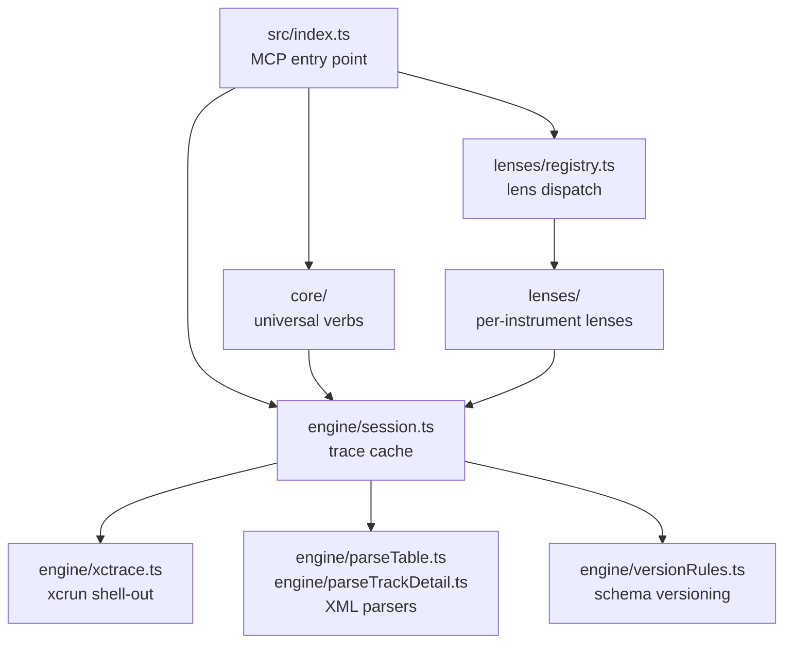

# Overall architecture

## Subsystems

**`src/index.ts` — MCP entry point**  
Registers all tools and lenses, wires up the MCP stdio transport. The only place new tools or lenses are added. See [howLensesWork.md](howLensesWork.md).

**`src/engine/session.ts` — trace cache**  
Owns the in-process session map. `openTrace()` loads a trace once; every subsequent tool call reuses the cached session. Parsed table rows accumulate in a per-(run, schema) cache so xctrace is never called twice for the same table. See [howSessionsWork.md](howSessionsWork.md).

**`src/engine/xctrace.ts` — xcrun shell-out**  
The only place in the codebase that calls `xcrun xctrace`. Two modes: `--toc` (enumerate schemas) and `--xpath` (pull one table as XML). All failure modes become structured `XctraceError` — raw stderr never reaches the agent. See [howSessionsWork.md](howSessionsWork.md).

**`src/engine/parseTable.ts` / `parseTrackDetail.ts` — XML parsers**  
Convert xctrace XML output into typed row objects. Handle the `id`/`ref` deduplication scheme in the XML. Two separate parsers because xctrace exports two structurally different XML formats (schema-table and track-detail). See [howFixturesWork.md](howFixturesWork.md).

**`src/engine/versionRules.ts` — schema versioning**  
Maps Xcode versions to rules versions and tracks which (version, schema) pairs have verified fixtures. The only place version-specific logic lives — the parser is intentionally version-unaware. See [howVersionResolutionWorks.md](howVersionResolutionWorks.md).

**`src/core/` — universal verbs**  
`query`, `aggregate`, `find`, `get_row`, `call_tree`, `describe_schema`, `list_instruments` — schema-agnostic tools that work on any instrument. Each reads from the session cache via `session.ts`. None contain instrument-specific logic.

**`src/lenses/` — per-instrument lenses**  
Optional ergonomic layer over the core verbs. Each lens declares which schemas it handles, contributes a `quickStart` for `open_trace`, and can register its own MCP tools. Purely additive — schemas with no lens still work. See [howLensesWork.md](howLensesWork.md).

**`src/core/response.ts` — envelope**  
Every tool wraps its result in a shared envelope with a `nextActions` array. This is how the agent navigates without knowing the schema — every response tells it what to call next. See [howHintsWork.md](howHintsWork.md) for how to decide what guidance goes where (auto-derived vs. curated, table-wide vs. per-row, proactive vs. reactive).
